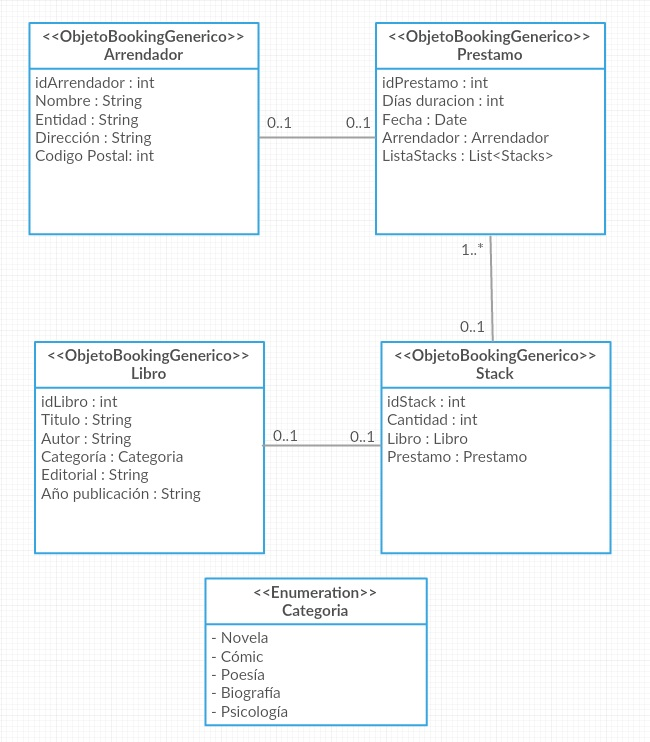
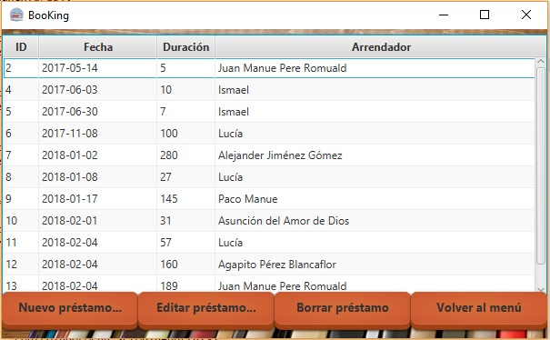

# Descripción
 

Boo-King es una aplicación de préstamo de libros entre **personas** que permite almacenar datos de libros, arrendadores y préstamos en una base de datos MySQL. La aplicación nos permitirá manipular estos datos de una forma mucho más *user-friendly*. Los receptores de préstamos se han obviado para simplificar un poco el proyecto :sweat_smile:.

> Este proyecto ha supuesto mucho trabajo pero como resultado, ha valido la pena :dancer:

- - - -

# Navegación
 

> [:octocat: Repositorio GitHub](https://github.com/ismenc/Boo-King) 
> [:globe_with_meridians: Página del proyecto](https://ismenc.github.io/Boo-King/) 
> [:scroll: Historial de versiones](https://github.com/ismenc/Boo-King/network) 
> [:arrow_down: Descargas](https://github.com/ismenc/Boo-King/releases) 
> [:memo: Tareas y mejoras propuestas](https://github.com/ismenc/Boo-King/issues)  
 

- - - -

# Índice
 

* Índice de contenidos
  * [1. Funcionalidad](#1-funcionamiento-de-la-aplicación)
    * [Base de datos](#base-de-datos-mysql)
    * [Aplicación Java](#aplicación-java)
    * [Interfaz gráfica](#interfaz-gráfica)
    * [Hibernate](#hibernate)
  * [2. Documentación](#2-documentación)
    * [Manual del proyecto](#manual-del-proyecto)
    * [Documentación JavaDoc](#documentación-javadoc)
    * [Diagrama de clases](#diagrama-de-clases)
    * [Historial de versiones](#historial-de-versiones)
  * [3. Cómo ejecutar la aplicación](#3-cómo-ejecutar-la-aplicación)
    * [Manual de instalación y uso](#manual-de-instalación-y-uso)
    * [Ejecución a través de IDE](#ejecución-a-través-de-un-ide)
  * [4. Cumplimiento de objetivos](#4-objetivos)
    * [Acceso a datos](#acceso-a-datos)
    * [Desarrollo de interfaces](#desarrollo-de-interfaces)
  * [5. Desarrollo](#5-especificaciones-de-desarrollo)
    * [Acceso a datos](#acceso-a-datos-1)
    * [Desarrollo de interfaces](#desarrollo-de-interfaces-1)
  * [6. Agradecimientos](#6-agradecimientos)

- - - -
 

# 1. Funcionamiento de la aplicación

La aplicación de *Boo-King* ofrece al usuario una interfaz agradable con la que administrar la base de datos de nuestra aplicación de préstamo de libros. Dicha aplicación ofrece una interfaz como la siguiente:

Tras elegir una opción, el programa interactuará con el usuario para pedirle los datos necesarios para operar y ofrecer los resultados.

## Base de datos MySQL

El servidor *MySQL* será responsable de **almacenar y establecer las relaciones** entre los datos de nuestra aplicación.
> La base de datos necesaria para la aplicación se encuentra en el archivo [BaseDatos.sql](./BaseDatos.sql).

En nuestro caso nos hemos servido de PHPMyAdmin para crear los elementos necesarios para el proyecto, los cuáles son los siguientes.

#### Tablas

Nombre | Descripción
------------ | ------------ 
Arrendador | *Datos de la persona que realizará préstmos de libros*
Libro | *Datos de un libro*
Préstamo | *Préstamo realizado por un arrendador*
Stack | *Tabla intermedia préstamo-libro que almacena la cantidad para cada libro en un préstamo*

#### Relaciones

Tablas | Relación
------------ | ------------ 
Arrendador-Préstamo | 1-N
Préstamo-Stack | 1-N
Stack-Libro | N-1
(Préstamo-Libro) | N-M

## Aplicación Java

*Java* es el encargado de realizar las operaciones lógicas correspondientes según la opción de menú elegida. Éste tendrá que manipular datos y hacer uso las librerías que harán de interfaz entre él y la base de datos.
> La clase principal CLI (ejecutable) es [Main.java](src/com/booking/ejecutable/Main.java).

#### Estructuración en paquetes

El código del proyecto está organizado en paquetes de forma que su estructura queda de la siguiente forma:

Paquete | Descripción
------------ | ------------ 
[ejecutable](./src/com/booking/ejecutable/) | Paquete con los archivos que serán ejecutados
[persistencia](./src/com/booking/persistencia/) | Clases que definen los objetos que manipularemos
[modelo](./src/com/booking/modelo/) | Clases con utilidades recurridas
[dao](./src/com/booking/dao/) | Clases que definen la interacción con la BD

## Interfaz gráfica

La *graphic user interface* (GUI) ha sido realizada mediante la librería **JavaFX** y la aplicación java **SceneBuilder**. La combinación de estas dos herramientas nos permite realizar interfaces de forma potente y aplicarles hojas de estilo (css) para dotar a nuestras aplicaciónes de un aspecto atractivo y colorido :rainbow:.
> La clase principal (ejecutable) de la interfaz es [MainGui.java](src/com/booking/ejecutable/MainGui.java).
> Podemos encontrar todo lo relativo a la visualización en el paquete [vista](src/com/booking/vista).

## Hibernate

Para conectar nuestro programa Java con MySQL hacemos uso de la librería *Hibernate*, que nos permitirá abstraernos de SQL y trabajar con objetos de forma que el proyecto se agiliza mucho más. También hacemos uso de **Hibernate validator**, que nos ayudará a validar los datos de entrada ahorrándonos el trabajo de programar validaciones en Java. Cabe destacar que Hibernate a su vez hace uso de la librería *JDBC* para conectarse con la base de datos, una librería que podría conectar por sí sola Java con la BD pero de forma mucho más primitiva.
> Para ello nos hemos basado en la ayuda de la profesora @Fátima y la [wiki curso de Hibernate](http://cursohibernate.es/doku.php).

#### Diagrama de clases

#### Consultas realizadas

En las clases Java del paquete [dao](./src/com/booking/dao/), realizamos consultas en varios métodos. 

Método | Clase | Tipo de consulta
------------ | ------------ | ------------ 
guardar | [GenericDAO](./src/com/booking/dao/GenericDao.java) | Básica
borrar | [GenericDAO](./src/com/booking/dao/GenericDao.java) | Básica
actualizar | [GenericDAO](./src/com/booking/dao/GenericDao.java) | Básica
obtener | [GenericDAO](./src/com/booking/dao/GenericDao.java) | Básica
obtenerPorNombre | [ArrendadorDAO](./src/com/booking/dao/ArrendadorDAO.java) | HQL
totalArrendadores | [ArrendadorDAO](./src/com/booking/dao/ArrendadorDAO.java) | HQL
obtenerPorNombre | [PrestamoDAO](./src/com/booking/dao/PrestamoDAO.java) | HQL
prestamosEnUnAno | [PrestamoDAO](./src/com/booking/dao/PrestamoDAO.java) | HQL
librosPrestadosEnUnAno | [PrestamoDAO](./src/com/booking/dao/PrestamoDAO.java) | HQL
totalPrestamos | [PrestamoDAO](./src/com/booking/dao/PrestamoDAO.java) | HQL
fechaPrimerPrestamo | [PrestamoDAO](./src/com/booking/dao/PrestamoDAO.java) | HQL
mediaLibrosPrestados | [PrestamoDAO](./src/com/booking/dao/PrestamoDAO.java) | HQL
totalLibrosPrestados | [StackDAO](./src/com/booking/dao/StackDAO.java) | HQL

#### Eliminación en cascada

Se ha aplicado la eliminación en cascada en las clases siguientes.

Clase | Clase víctima del cascada | Razón
------------ | ------------ | ------------ 
[Arrendador](./src/com/booking/persistencia/Arrendador.java) | [Préstamo](./src/com/booking/persistencia/Prestamo.java) | Naturaleza de la relación (préstamo no puede existir sin arrendador)
[Préstamo](./src/com/booking/persistencia/Prestamo.java) | [Stack](./src/com/booking/persistencia/Stack.java) | Naturaleza de la relación (no puede haber pilas de libros prestados sin su préstamo)

#### Validaciones

Se han implementado validaciones en los objetos con hibernate validator, tales validaciones incluyen:
* Introducción de números, máximos y mínimos.
* Limitación de cadenas de carácteres.
* Patrones
* Condiciones definidas en métodos
* Tipo fecha
* Objetos válidos

- - - -
 

# 2. Documentación

:information_source: La información y **documentación** se encuentra en la carpeta [doc](./doc/) incluyendo los siguientes documentos.

### Manual del proyecto

Se trata de un white paper o manual dónde se explica el proyecto Boo-King. 
> Es el documento actual [README.md]().

### Documentación JavaDoc

Es la documentación web generada a partir de los comentarios JavaDoc en código, principalmente para desarrolladores y colaboradores.
> Puedes acceder a ella a través del [Index JavaDoc](https://ismenc.github.io/Boo-King/doc/).

### Diagrama de clases

Es el **esquema UML** que representa las clases persistencia de Hibernate y sus relaciones entre sí.
> [Diagrama de clases](./doc/diagramaclases.jpg)

### Historial de versiones

Es un representación gráfica de todas las versiones (commits) por las que ha pasado el proyecto. Te recomiendo que le eches un vistazo.
> Puedes ver el árbol de versiones en este [enlace](https://github.com/ismenc/Boo-King/network).

- - - -
 

# 3. ¿Cómo ejecutar la aplicación?

## Manual de instalación y uso

#### Base de datos

1. Deberemos instalar la base de datos MySQL con PHPMyAdmin.
2. Desde PHPMyAdmin, crear la base de datos 'booking'.
3. Importar el archivo [BaseDatos.sql](BaseDatos.sql) en la base de datos que acabamos de crear.

#### Linux

1. Dirígete a [releases](https://github.com/ismenc/Boo-King/releases) y descarga el instalador `.jar`.
2. Abre el instalador con *doble click* o *abrir con JVM*.
3. (Si no funcionó) Abre una terminal y navega a la carpeta dónde lo has descargado mediante el comando `cd carpeta`.
4. Abre el instalador mediante `java -jar Boo-King4.1-install.jar` y sigue los pasos.

#### Windows

1. Dirígete a [releases](https://github.com/ismenc/Boo-King/releases) y descarga el instalador `.exe`.
2. Abre el instalador mediante *doble click*.
3. Sigue los pasos.

### Configuración

La aplicación mostrará una barra de menús y 3 botones con los que podremos acceder a todas las funcionalidades.

* El menú `Archivo` muestra opciones de configuración de la aplicación.
* El menú `Administrar` da acceso a los paneles de administración de *arrendadores*, *libros* y *préstamos*, al igual que los botones que aparecen en pantalla.
* El menú `Informes` ofrece opciones para generar informes (reportes) en pdf sobre los datos de nuestra aplicación.
* El resto de menús ofrece fuentes de información adicionales al usuario.

### Administración y uso

:hand: Antes de empezar a usar nuestra aplicación, deberemos configurar las **credenciales de acceso** a la base de datos. Para ello abrimos el menú `Archivo` -> `Configurar BBDD`. Si no realizamos este paso los valores por defecto serán `root` y `123456`.
Ahora podremos operar con nuestra aplicación.

Cualquiera de las opciones de **administrar** que abramos, contiene una tabla con los datos en cuestión, extraídos de la base de datos, y una serie de botones que nos ofrecerán diferentes operaciones como *añadir*, *editar* y *borrar* tuplas de la tabla. Tan sólo tenemos que seleccionar la tupla que queremos alterar y pulsar sobre *editar* o *borrar* para manipularla o simplemente pulsar sobre *añadir* y en cualquier caso nos aparecerá un diálogo adicional solicitando los datos que sean necesarios.

Nuestra aplicación ofrece una función para generar **reportes**. Estos reportes consisten en informes PDF con los datos de la tabla, estadísticas, gráficas y su fecha de emisión. Para generarlos, tendremos que volver al menú principal y pulsar sobre `Informes` y la opción que deseemos. Se generará un PDF en la carpeta de instalación y se abrirá automáticamente una ventana para visualizarlo, ¡pero tendrás que ser paciente! :turtle:

### Recursos adicionales

El programa ha sido desarrollado sobre windows 10. Por lo tanto la experiencia visual puede verse alterada en otros sistemas operativos. Algunos problemas son:

* Los recursos usados por la aplicación se encuentran incluidos en ella, aún así no podemos instalar la fuente usada para los títulos sin tu permiso.

  > Para ello se incluye la fuente en la carpeta resources, dentro de la carpeta de instalación.
* En sistemas Linux, la vista principal queda ligeramente desplazada.

## Ejecución a través de un IDEE

Puedes usar esta opción si:

:red_circle: Quieres configurar en profundidad la base de datos.

:broken_heart: Si las otras alternativas no funcionaron.

:thumbsup: Si deseas ver y modificar el código fuente.

1. Descargar código fuente del proyecto mediante clone o en [releases](https://github.com/ismenc/Boo-King/releases).
2. Impórtalo en tu IDE Java favorito.
3. Configurar datos de acceso a BD en el archivo *hibernate.cfg.xml*.
4. Ejecuta *Main.java* o bien *MainGui.java*.

- - - -
 

# 4. Objetivos

## Acceso a Datos

* Requisitos mínimos
  - [X] La BD debe constar de al menos tres tablas relacionadas entre si
  - [X] Deben existir relaciones 1:N (al menos 1)
  - [X] Debe existir algún campo autonumérico
  - [X] Tipo enumerado en alguna tabla
  - [X] Validaciones con Hibernate Validator
  - [X] Deben poder realizarse operaciones de inserción en todas las tablas de la BD (>= 3)
  - [X] Deben poder realizarse operaciones de consultas HQL de todas las tablas de la BD (>= 3)
  - [X] Deben poder realizarse operaciones de modificación de al menos una tabla de la BD
  - [X] Deben poder realizarse operaciones de baja de al menos una tabla de la BD
  - [X] Utilización del patrón DAO
  - [X] Gestión de transacciones :grey_question:

* Aspiras alto, amigo
  - [X] Existencia de una relación N:M implementada como dos relaciones y 1:N
  - [X] Existencia de relación 1:N ordenada
  - [X] Tipo fecha en alguna tabla
  - [ ] Paginación
  - [X] Métodos java de validación
  - [X] Existencia de claves únicas
  - [X] Complejidad de la aplicación, de las consultas y operaciones realizadas
  - [X] Calidad de software y estilo de programación. YEA
  - [X] Calidad de la documentación
  
## Desarrollo de interfaces

> :construction: This is work in progress my frienderino! :construction:

- - - -
 

# 5. Especificaciones de desarrollo

## Acceso a datos

* Los **requisitos de la base de datos** se han descrito en la sección [Base de datos](#base-de-datos-mysql).
* Los **requisitos de consultas** se han descritos en [Consultas realizadas](#consultas-realizadas).
* La explicación del **cascade** está en [Eliminación en cascada](#eliminación-en-cascada).

### Cosas que caben destacar

* Validaciones realizadas en métodos, ver [Validaciones](#validaciones).
* En todo momento he deseado superarme programando este proyecto, a nivel de organización, documentación, control de versiones y presentación. Sé que no he hecho un proyecto atractivo por fuera, pero he intentado que por dentro sea *adorable* :koala:.

  > La verdad es que estoy tan ~~muerto~~ fuera de combate que no quiero ni saber qué nota tendrá.
* He invertido la mayoría del tiempo en re-escribir código y documentar la aplicación para que sea mantenible.
* He tenido dificultades puntuales con alguna consulta HQL.
* He aprendido cómo conectar lenguajes lógicos con bases de datos de forma muy práctica.
* He aprendido mazo de Git & GitHub :octocat: con mucho esfuerzo, pero porque yo he decido que así sea :heart:.

  > Creo que ha valido mucho la pena.
* A mi pesar he tenido que retrasar la interfaz gráfica y funcionalidades como la paginación en los plazos.

## Desarrollo de interfaces

> :construction: Estamos repartiendo alquitrán por aquí, vuelve más tarde :construction:

> sudo apt-get install openjfx

- - - -
 

# 6. Agradecimientos

Agradecimientos especiales a las siguientes personas sin las cuales el proyecto no podría haber acabado:
* Profesora Fátima Olías que ha transmitido sus conocimientos y me ha salvado de obstáculos importantes :heart_eyes:
* Compañeros de clase que, aunque algo pillos, siempre están ahí :stuck_out_tongue_closed_eyes:
* StackOveflow, cuna de programadores :computer:
* GitHub, plataforma en la que se basa estas páginas :octocat:

> Hasta el siguiente!!
:kissing_closed_eyes:

